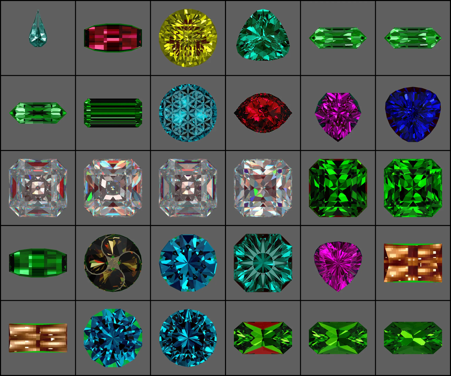

# GemGrid

Tile a folder of animated GIFs into a single animated WebP contact sheet.

Built for [GemCutStudio](https://www.gemcutstudio.com/) turntable animations — a
folder of rotating faceted gemstones becomes one grid you can view at a glance —
but it makes no assumptions about its input. Sources may differ in frame count,
per-frame delay and pixel dimensions; they get resampled onto a single fixed-rate
output timeline.



## What it does

- **Picks the grid shape** from the file count — 30 clips become 6×5, 12 become
  4×3. A prime count like 7 becomes 4×2 with one empty cell rather than a 7×1
  ribbon, because the layout cost function trades empty cells against grid
  proportions instead of ranking one above the other.
- **Solves the cell resolution** to the largest that still fits a size budget.
  It encodes a 12-frame sample, extrapolates, and bisects — so it finds the
  answer in a handful of probes instead of re-encoding the whole file per trial.
- **Resamples onto one timeline.** Output length equals the longest source.
  Shorter clips loop inside that window rather than freezing on a final frame.
  Per-frame delays are read individually, so variable-rate sources are handled;
  a missing or `0 ms` delay falls back to 100 ms.
- **Composites correctly.** Frames are read through `ImageSequence.Iterator` and
  converted to RGBA, so GIF frame disposal and partial-frame updates resolve
  properly instead of tearing.
- **Fits, never crops.** Each frame is contain-fit into its cell, aspect
  preserved and centred on a solid background.

Sources are opened read-only and are never modified.

## Why WebP out and not GIF

WebP is about a third the bytes, and that headroom goes straight into
resolution. On a real 30-clip set at the same ~38 MB:

| | GIF | WebP |
|---|---|---|
| Cell size | 200 px | **432 px** |
| Output | 1242×1036 | **2634×2196** |
| Pixels | 1.0× | **4.7×** |

WebP is also full colour — no 256-entry palette, no dithering — and stores frame
delays in exact milliseconds rather than GIF's 10 ms centiseconds, so a 30 ms
source rate is reproducible instead of being rounded.

> **Viewing:** Windows Photos and Explorer preview render only the **first
> frame** of an animated WebP. The file is fine; those viewers are not. Open it
> in Edge, Chrome or Firefox — or use the GUI's **Open in browser** button.

## Install

```bash
pip install -r requirements.txt
```

Python 3.8+ and Pillow. Nothing else.

## Use it

### GUI

Run `GemGrid.exe`, or:

```bash
python gemgrid_gui.py
```

Pick a source folder, accept or edit the output name (defaults to
`gemgrid-<timestamp>.webp`), tick **Lossless (slower)** if you want it, press
**Build**. Progress streams into the log pane and the build is cancellable.

Lossless relaxes the size budget from 40 MB to 400 MB — holding lossless to the
lossy budget would just shrink the cells until it fit, defeating the point. The
choice is printed in the log rather than applied silently.

### Command line

```bash
python anim_grid.py <input_folder> <output.webp> [options]
```

```bash
python anim_grid.py "D:\gems" grid.webp
python anim_grid.py "D:\gems" grid.webp --max-mb 80 --fps 25
python anim_grid.py "D:\gems" grid.webp --cols 5 --rows 6 --cell 360
python anim_grid.py "D:\gems" grid.webp --lossless
```

| Option | Default | What it does |
|---|---|---|
| `--max-mb` | 40 | Size budget; the cell size is solved up to this |
| `--fps` | 20 | Output timeline rate |
| `--cols` / `--rows` | auto | Override the layout; either alone infers the other |
| `--aspect` | 1.33 | Preferred grid w:h when auto-picking the layout |
| `--cell` | auto | Fixed cell px; skips the resolution solver |
| `--max-cell` / `--min-cell` | 512 / 48 | Bounds for the solver |
| `--gap` | 6 | Pixels between cells, and the outer margin |
| `--bg` | `#000000` | Background / letterbox colour |
| `--quality` | 80 | WebP quality, 0–100 |
| `--method` | 4 | WebP effort 0–6; 6 is slower and slightly smaller |
| `--lossless` | off | Lossless WebP; much larger, ignores `--quality` |
| `--loop` | 0 | 0 = forever |
| `--mem-gb` | 8 | Cap on the decoded-frame cache |
| `--dry-run` | off | Report the plan and exit without encoding |

Files are placed left-to-right, top-to-bottom in natural sort order, so `gem2`
precedes `gem10`.

## Tests

```bash
python test_anim_grid.py
```

A real GemCutStudio folder is uniform — same dimensions, same frame rate — so it
never exercises the mismatch handling. The suite builds a synthetic corpus that
deliberately violates every assumption: eight clips at 240×120, 100×300, 128²,
160² and 200², frame counts from 1 to 25, delays uniform / per-frame-varied /
literally `0` / absent entirely, plus one clip using transparency and
`disposal=2`.

Every synthetic frame encodes its own identity in its colour — green channel
says which clip, red channel says which frame — so reading a single pixel from
the finished grid proves both that the clip landed in the right cell *and* that
the correct frame was sampled at that instant. Expectations are computed from
the delays used to author the sources, not re-read from them.

31 checks, including 140 pixel-exact frame-identity samples, the delay
fallbacks, short-clip looping, transparency compositing, the WebP dimension
ceiling, and the budget solver against a deliberately brutal 0.30 MB target.

One of them guards a subtlety worth knowing about: when `--fps` exceeds a
source's own rate the timeline contains duplicate frames, and WebP merges
identical adjacent frames into one with a summed duration. So the stored frame
count can be lower than the timeline frame count — an optimisation, not lost
time. The suite parses the container's raw `ANMF` chunks and asserts the total
duration still equals the timeline exactly, because the failure mode would be
an animation that silently runs short.

The frozen `.exe` can also test itself, which catches a PyInstaller build that
looks fine but is missing Pillow's WebP encoder:

```bash
GemGrid.exe --selftest report.txt
```

The suite is mutation-tested: swapping natural sort for lexical sort fails 120
of 140 samples, so a green run means something.

## Build the exe

```bash
python build_exe.py --clean
```

Produces `dist/GemGrid.exe` (~17 MB, single file, no console window). Requires
`pip install pyinstaller`.

## License

MIT — see [LICENSE](LICENSE).
